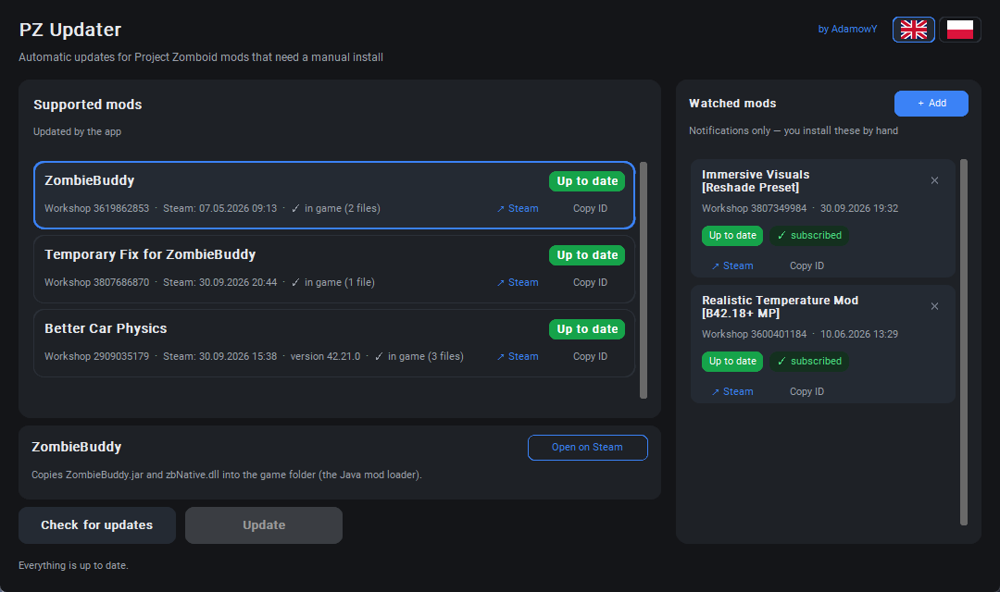

# PZ Updater

Updater for Project Zomboid mods that need a manual install — the ones where
subscribing on Steam is not enough and files still have to be copied into the
game folder by hand.



Windows · Python 3.8+ · [latest release](https://github.com/Adamowyy/PZUpdater/releases/latest)

## Mod requests

**The list of supported mods is kept by hand.** If a mod you use needs manual
file work and you would like PZ Updater to handle it, message me on Discord:
**xadamowy**. Send the workshop link and, if you know, which files go where. I
add the ones that can be automated safely.

## What it does

- Finds Steam, Project Zomboid and the workshop folder on its own (registry +
  `libraryfolders.vdf`, so a game on another drive is fine).
- Asks the Steam Web API for the last update time of every mod and remembers
  what it applied, so you can see what is new.
- Checks whether the mod files are actually in the game folder, not just
  subscribed.
- Copies what needs copying — per mod, or all of it at once.

Nothing else is touched: no backups are made, nothing is deleted. The app only
writes the paths listed for a mod in [the registry](#adding-a-mod).

## Supported mods

| Mod | Workshop ID | What it installs |
| --- | --- | --- |
| ZombieBuddy | 3619862853 | `ZombieBuddy.jar` and `zbNative.dll` into the game folder (the Java mod loader) |
| Temporary Fix for ZombieBuddy | 3807686870 | replaces `ZombieBuddy.jar` with a build that works on 42.21 |
| Better Car Physics | 2909035179 | the `zombie` folder from the newest version in `manual_installation` |

Mods in the right-hand column of the window are **watched**: notifications only.
The app tells you when their author published something and you install it
yourself.

## Subscription is not an installation

Steam's "time updated" only says when the author published a file. It says
nothing about whether those files are in your game folder — and that is how mods
like these break in practice: you subscribe, everything looks fine, but the
manual part was never copied; or you delete the files at some point and Steam
does not bring them back.

So the target files of every mod are compared against the workshop copy:

| Badge | Meaning |
| --- | --- |
| Subscribed, not installed | the mod is in your workshop, its files are not in the game folder |
| Update available | an older or different version of the files sits in the game folder |
| New update | the files are in place and the author published something newer |
| Up to date | files match the workshop copy, nothing newer on Steam |
| Not subscribed | no workshop folder for this mod |
| Obsolete | another supported mod supersedes this one |

Mods that are not installed yet are greyed out, and installing one is always a
separate click. The main **Update** button only touches mods that are already in
the game folder, so it never pulls something into the game you did not ask for.

## Getting started

Grab `PZUpdater.exe` from the [latest release](https://github.com/Adamowyy/PZUpdater/releases/latest)
and run it. Steam and Project Zomboid have to be installed; there is nothing to
configure.

Running from source:

```bash
pip install customtkinter
python pzupdater.py
```

## Building the exe

```bash
uv venv --python 3.11 .buildenv
uv pip install --python .buildenv/Scripts/python.exe pyinstaller customtkinter
.buildenv/Scripts/python.exe -m PyInstaller --noconfirm PZUpdater.spec
```

The result is `dist/PZUpdater.exe` — a single file with no console window.

## Tests

```bash
.buildenv/Scripts/python.exe -m unittest discover -s tests -v
```

The tests cover file comparison, the mod registry and the translations. They do
not need Steam or the game to be installed.

## Adding a mod

Only mods that need manual file work belong on the list. The format is described
in [CONTRIBUTING.md](CONTRIBUTING.md#adding-a-mod) — most entries are a handful
of lines, because the app finds the version folders and the jar paths itself.

## Languages

The interface ships in English and Polish. Switch with the flags in the top-right
corner; the choice is stored in `state.json`. A new language is one table in
`i18n.py` — see [CONTRIBUTING.md](CONTRIBUTING.md#adding-a-language).

## Requests, bugs, feedback

- Discord: **xadamowy** — mod requests, questions, anything else.
- [Issues](https://github.com/Adamowyy/PZUpdater/issues) — bugs and ideas.

When something goes wrong, the app's log window (click the status line at the
bottom, or the error toast) lists the paths it detected — that usually answers
the first few questions.

## License

MIT — see [LICENSE](LICENSE).

Not affiliated with The Indie Stone. Project Zomboid and Steam belong to their
respective owners.

## Polski

Aktualizator modów Project Zomboid, które wymagają ręcznej instalacji — tych,
gdzie subskrypcja w Warsztacie nie wystarcza i pliki trzeba skopiować do folderu
gry. Interfejs ma przełącznik języka (flagi w prawym górnym rogu), a stan
program trzyma w `%APPDATA%\PZUpdater\state.json`.

**Chcesz, żeby program obsługiwał Twojego moda?** Napisz na Discordzie:
**xadamowy** — podeślij link do Warsztatu, a jeśli wiesz, które pliki gdzie
trafiają, zautomatyzuję to od razu.
