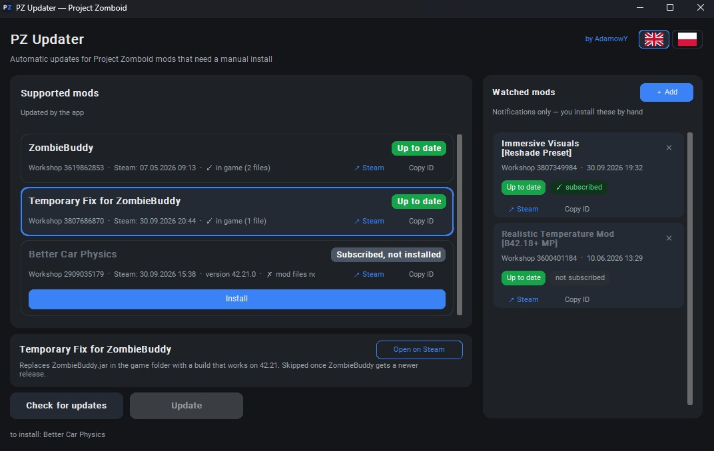

# PZ Updater

Updater for Project Zomboid mods that need a manual install — the ones where
subscribing on Steam is not enough and files still have to be copied into the
game folder by hand.



<sub>Better Car Physics is subscribed but its files are not in the game folder yet — that card is greyed out and has its own **Install** button, while the main **Update** button stays off the table.</sub>

## Install

**Download [PZUpdater.exe](https://github.com/Adamowyy/PZUpdater/releases/latest) and run it.**
That is the whole installation: one file, no setup, nothing to configure.

1. Open the [latest release](https://github.com/Adamowyy/PZUpdater/releases/latest)
   and download `PZUpdater.exe` from the assets.
2. Run it. Windows may show SmartScreen ("unknown publisher") because the exe is
   not code-signed — *More info* → *Run anyway*.
3. Press **Check for updates**. Steam, the game folder and the workshop are found
   on their own, also when the game sits on another drive.

Requirements: Windows, Steam and Project Zomboid (build 42) installed.

There is no installer, so there is nothing to uninstall either — delete the exe.
The app keeps its state (applied mod timestamps, watched mods, language) in
`%APPDATA%\PZUpdater\state.json`; delete that file too if you want a clean slate.

The app only writes the mod paths listed below. No backups, and it touches
nothing else in the game folder; what it installed it can also take back again
(see below).

## Mod requests

**The list of supported mods is kept by hand.** If a mod you use needs manual
file work and you would like PZ Updater to handle it, message me on Discord:
**xadamowy**. Send the workshop link and, if you know, which files go where. I
add the ones that can be automated safely.

## What it does

- Finds Steam, Project Zomboid and the workshop folder on its own (registry +
  `libraryfolders.vdf`, so a game on another drive is fine).
- Asks the Steam Web API for the last update time of every mod and remembers
  what it applied, so you can see what is new.
- Checks whether the mod files are actually in the game folder, not just
  subscribed.
- Copies what needs copying — per mod, or all of it at once.

## Supported mods

| Mod | Workshop ID | What it installs |
| --- | --- | --- |
| ZombieBuddy | 3619862853 | `ZombieBuddy.jar` and `zbNative.dll` into the game folder (the Java mod loader) |
| ZombieBuddy BETA | 3812624292 | the same two files from the beta build. The row appears only while the beta is newer than ZombieBuddy and hides itself once ZombieBuddy passes it |
| [B42] ZombieBuddy Extensions | 3807686870 | replaces `ZombieBuddy.jar` with the extension build (the 42.21 temporary fix under its new name) |
| Better Car Physics | 2909035179 | the `zombie` folder from the newest version in `manual_installation` |
| Tempo - A Performance & FPS Optimizer | 3736629791 | the three compiled `.class` patches, from the `manual_installation` folder named after the game build |

Mods in the right-hand column of the window are **watched**: notifications only.
The app tells you when their author published something and you install it
yourself.

## Subscription is not an installation

Steam's "time updated" only says when the author published a file. It says
nothing about whether those files are in your game folder — and that is how mods
like these break in practice: you subscribe, everything looks fine, but the
manual part was never copied; or you delete the files at some point and Steam
does not bring them back.

So the target files of every mod are compared against the workshop copy:

| Badge | Meaning |
| --- | --- |
| Subscribed, not installed | the mod is in your workshop, its files are not in the game folder |
| Update available | an older or different version of the files sits in the game folder |
| New update | the files are in place and the author published something newer |
| Up to date | files match the workshop copy, nothing newer on Steam |
| Not subscribed | no workshop folder for this mod |
| Obsolete | another supported mod supersedes this one |

Mods that are not installed yet are greyed out, and installing one is always a
separate click. The main **Update** button only touches mods that are already in
the game folder, so it never pulls something into the game you did not ask for.

Two things are worth knowing about the mods that need hand work:

- **Tempo's three files are made for one game version each.** The app copies the
  ones matching the version your game reports, and leaves everything alone when it
  cannot check that. After a game update, start the game once before installing
  them again.
- **What the app installed, it can take back.** A mod whose install the app
  recorded has an **Uninstall** button that deletes exactly those files, and only
  while they still have the bytes the app wrote. Anything else in the game folder
  stays untouched; a file somebody changed since is left alone and reported.

Both columns are ordered by what you can do with a mod rather than by the order
they were added in: a mod with something to install or update sits at the top, an
installed and current one below it, and a mod that is not on this machine at all
(nothing subscribed, nothing installed) at the bottom. Rows in the same state keep
the order of the mod list / the order you added them in.

## Languages

The interface ships in English and Polish. Switch with the flags in the top-right
corner; the choice is stored in `state.json`. A new language is one table in
`i18n.py` — see [CONTRIBUTING.md](CONTRIBUTING.md#adding-a-language).

## Requests, bugs, feedback

- Discord: **xadamowy** — mod requests, questions, anything else.
- [Issues](https://github.com/Adamowyy/PZUpdater/issues) — bugs and ideas.

When something goes wrong, the app's log window (click the status line at the
bottom, or the error toast) lists the paths it detected — that usually answers
the first few questions.

## Development

Nothing in this section is needed to use the app.

Running from source:

```bash
pip install customtkinter
python pzupdater.py
```

Building the exe:

```bash
uv venv --python 3.11 .buildenv
uv pip install --python .buildenv/Scripts/python.exe pyinstaller customtkinter
.buildenv/Scripts/python.exe -m PyInstaller --noconfirm PZUpdater.spec
```

The result is `dist/PZUpdater.exe` — a single file with no console window.

Tests:

```bash
.buildenv/Scripts/python.exe -m unittest discover -s tests -v
```

They cover file comparison, the mod registry and the translations, and need
neither Steam nor the game.

Adding a mod: only mods that need manual file work belong on the list. The format
is described in [CONTRIBUTING.md](CONTRIBUTING.md#adding-a-mod) — most entries are
a handful of lines, because the app finds the version folders and the jar paths
itself.

## License

MIT — see [LICENSE](LICENSE).

Not affiliated with The Indie Stone. Project Zomboid and Steam belong to their
respective owners.

## Polski

**Pobierz [PZUpdater.exe](https://github.com/Adamowyy/PZUpdater/releases/latest)
i uruchom go** — to cała instalacja: jeden plik, bez instalatora, bez
konfiguracji. Potrzebne są tylko Windows, Steam i Project Zomboid (build 42).
Windows może pokazać SmartScreen („nieznany wydawca", bo exe nie jest podpisany):
*Więcej informacji* → *Uruchom mimo to*.

Program sam znajduje Steama, grę i Warsztat, sprawdza datę publikacji każdego
moda i kopiuje pliki, które trzeba skopiować ręcznie. Interfejs ma przełącznik
języka (flagi w prawym górnym rogu), a stan trzyma w
`%APPDATA%\PZUpdater\state.json`. Zmienia wyłącznie pliki modów z listy — bez
backupów i bez kasowania czegokolwiek.

**Chcesz, żeby program obsługiwał Twojego moda?** Napisz na Discordzie:
**xadamowy** — podeślij link do Warsztatu, a jeśli wiesz, które pliki gdzie
trafiają, zautomatyzuję to od razu.
